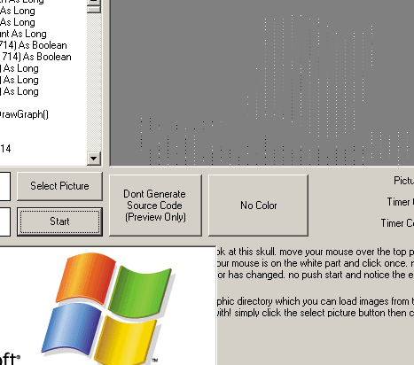



## Smooth Effects 1\.0 \- Create your own animated \(program intro\) from any image\. See SS

### Description

Smooth Effects 1.0 Will take any normal image that you specifie and make a working application intro from it! Smooth Effects 1.0 steps through each section of a image grabbing the cordinece once every set ammount of pixel's giving the image a floating cut out effect. on top of that the floating layers will move any direction while bouncing off the walls and still staying in propper order.

No need to sift through my code to make your own intro! I have built in a intro creator that will generate all needed source code to create your very own intro with your very own image!

Project includes 3 sample projects which where created with Smooth Effects along with 5 sample images you can play around with.
 
### More Info
 
Just requires you to choose a picture and set a few variables

Super Simple Intro Creator with neat effects

Tons of source code to give you a great looking intro!

None this intro and all software runs great on a 450mhz with 200megs of ram!

             |
---                |---
**Submitted On**   |2002-09-08 07:44:46
**By**             |[meth0s](https://github.com/Planet-Source-Code/PSCIndex/blob/master/ByAuthor/meth0s.md)
**Level**          |Beginner
**User Rating**    |4.6 (23 globes from 5 users)
**Compatibility**  |VB 5\.0, VB 6\.0, VB Script
**Category**       |[Graphics](https://github.com/Planet-Source-Code/PSCIndex/blob/master/ByCategory/graphics__1-46.md)
**World**          |[Visual Basic](https://github.com/Planet-Source-Code/PSCIndex/blob/master/ByWorld/visual-basic.md)
**Archive File**   |[Smooth\_Eff128350982002\.zip](https://github.com/Planet-Source-Code/meth0s-smooth-effects-1-0-create-your-own-animated-program-intro-from-any-image-see-ss__1-38770/archive/master.zip)

### API Declarations

In module

